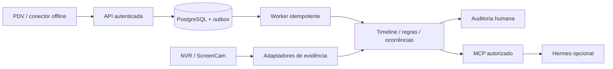

# TRD — Plataforma P3

Data: 2026-09-19. Estado: arquitetura proposta; bootstrap implementado separadamente.

## Stack

| Dimensão | Escolha / estado |
|---|---|
| Linguagem/runtime | Python 3.12; host verificado e container python:3.12-slim |
| HTTP | FastAPI 0.115.12 / Uvicorn 0.34.2 fixados; validação pelo build |
| Banco futuro | PostgreSQL; instância 14 existente preservada; role e banco P3 ainda não criados |
| Build/teste | Docker multi-stage, pip, pytest; versões diretas fixadas |
| Frontend inicial | HTML sem bundle; interface de auditoria será mudança própria |
| Entrega | GitHub Actions → GHCR → webhook de stack Portainer BE, condicionado à edição |
| Processo | Harness portátil + OpenSpec 1.13.1 via Node 22 em container |

Dependências transitivas fixadas em constraints.txt e imagem base por digest.
Hashes dos pacotes e auditoria de vulnerabilidades são gate antes da liberação produtiva. As versões aqui não são afirmação de “última versão”.

## Arquitetura

Proposta: monólito modular orientado a eventos com worker separado quando necessário.
Módulos futuros: identidade, ingestão, timeline, regras, ocorrências, evidências e
adaptadores MCP/Hermes. Bootstrap expõe somente página e endpoints de disponibilidade.
Separar eventos de telemetria em contratos e retenção; broker dedicado depende de carga.

Pastas: `app/` HTTP inicial; `tests/` contratos atuais; `deploy/` stack;
`docs/` visão/decisões; `openspec/` requisitos e execução; `.harness/` snapshot.

Modelo lógico proposto: Tenant → Organization → Store → Terminal; CameraMapping
possui intervalo de validade. Event pertence a tenant/loja/terminal e referencia
Transaction, Session e Line. Occurrence referencia eventos, RuleVersion, RiskFactor,
Evidence e AuditEntry. Chaves e FKs compostas incluem tenant; IDs externos são
namespaced pelo integrador. Sem migração nesta entrega.

Persistência futura: transação grava evento + outbox antes do ACK; worker grava efeito
com chave idempotente. Retry com jitter e quarentena para falhas permanentes. Sem
promessa de exactly-once no transporte. Migrações expand/contract; testar restauração
e compatibilidade N/N-1 antes de alterar dados. Rollback de imagem não desfaz migração.

## Requisitos Não-Funcionais

Todos os números seguintes são metas propostas de laboratório, não SLA contratado.

| ID / dimensão | Meta proposta e medição |
|---|---|
| NFR01 / performance | ingest p95 ≤300 ms a 50 eventos/s por 15 min; medir HTTP no servidor separadamente de clock drift |
| NFR02 / integridade | zero eventos reconhecidos perdidos e zero efeitos duplicados após restart/replay no teste |
| NFR03 / isolamento | zero leituras/escritas cruzadas na suíte de dois tenants |
| NFR04 / disponibilidade | único nó sem HA; RPO ≤24 h e RTO ≤4 h são alvos sujeitos a restore medido |
| NFR05 / capacidade | bootstrap limitado a 256 MiB/0,5 CPU; produto precisa de dimensionamento do piloto |
| NFR06 / segurança | TLS; mínimo privilégio; nenhuma credencial em logs/repositório; retenção validada antes de dados reais |
| NFR07 / observabilidade | logs estruturados sem payload pessoal; request_id; erros, duração, backlog, drift e falhas de vídeo |
| NFR08 / acessibilidade | teclado, foco visível, contraste e sem overflow a 360/768/1366/1920 px em zoom 100% |

## Dependências Externas

| Serviço | Restrição | Dono proposto |
|---|---|---|
| GitHub/GHCR | escrita por GITHUB_TOKEN do repositório; pull privado com read:packages | Wittemberg |
| Portainer | stack webhook BE; POST não comprova convergência | infraestrutura |
| Traefik/DNS | interna, websecure, letsencryptresolver; CNAME não configura router/certificado | infraestrutura |
| PostgreSQL | compartilhado; quotas, backup e role independente antes de uso | infraestrutura |
| PDV/NVR | SO/display, codecs e histórico a testar no hardware real | integrador |
| Hermes/modelo | provider e custo não selecionados; falha não interrompe operação | produto |

## Padrões

Baseline corporativa: `.harness/standards/wittemberg/README.md` e engineering/
SECURITY-BASELINE, persistência e não-regressão aplicáveis conforme arquivos do snapshot.
Testes: pytest; `docker build --target test -t p3-test .`. Cobertura percentual ainda
não contratada; comportamentos críticos exigem cenários positivos/negativos e restart.
Estilo: PEP 8, snake_case; Ruff fixado no ambiente de desenvolvimento, verificado no build de testes; formatação ampla não aplicada ao legado.
Erros de domínio explícitos; resposta sem stack trace; falhas operacionais com responsável
identificável. Logs de bootstrap são os do Uvicorn; JSON/correlação são requisitos futuros.

Autenticação futura: OIDC para pessoas (provedor a selecionar); credenciais de integração
com escopo de tenant/loja, hash, rotação e revogação. Tenant resolvido no servidor.
RLS e políticas na camada de serviço como defesa em profundidade; application role
sem BYPASSRLS e sem propriedade que contorne políticas. MCP reaproveita autorização.
Bootstrap não recebe dados reais nem oferece login fictício.

UI futura: tokens corporativos, estados loading/empty/error/offline e feedback explícito;
lista de ocorrências → filtros → timeline → evidência → conclusão. Só congelar baseline
visual após aprovação; página inicial atual é indicador de preparação.

## Decisões Globais

| ADR | Título | Status | Data |
|---|---|---|---|
| [001](adrs/001-infraestrutura.md) | Swarm, Portainer e GHCR | aceito quanto à escolha do usuário; webhook condicionado | 2026-09-19 |
| [002](adrs/002-modularidade.md) | Monólito modular e PostgreSQL | proposto | 2026-09-19 |
| [003](adrs/003-eventos.md) | Tempo, identidade e durabilidade | proposto | 2026-09-19 |
| [004](adrs/004-ia.md) | Hermes desacoplado via MCP | aceito conforme v0.2 | 2026-09-19 |
| [005](adrs/005-isolamento.md) | Isolamento e evidências | proposto | 2026-09-19 |
| [006](adrs/006-contrato-m1.md) | Contrato preliminar e conformidade M1 | aceito | 2026-09-20 |

Contrato de integração: [Event Protocol 0.1.0](contracts/event-protocol-0.1.0.md).
Runtime serve os documentos em rotas somente leitura. Oráculo sintético permanece
em scripts/event_conformance.py e não é usado pela aplicação para aceitar dados.
